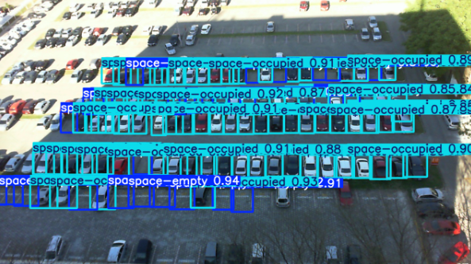

# 🚗 Smart Parking Space Detection System (YOLOv8)

## 📌 Project Overview
This project utilizes the **YOLOv8 (You Only Look Once)** deep learning model to detect and count available parking spaces in real-time. The system is trained on a custom dataset to distinguish between **"space-empty"** and **"space-occupied"** classes, providing a solution for automated parking management.

## 📊 Results
* **Model:** YOLOv8 (Ultralytics)
* **mAP50 Accuracy:** 99.5%
* **Precision:** High detection rate even in dense parking lots.
* **Training Epochs:** 5

## 📂 Dataset
The model was trained on the **Parking Lot Database for YOLO**.
You can download the full dataset here:
👉 [Kaggle Dataset Link](https://www.kaggle.com/datasets/duythanhng/parking-lot-database-for-yolo)

## 🛠️ Tech Stack
* **Language:** Python
* **Framework:** PyTorch & Ultralytics YOLO
* **Environment:** Google Colab (GPU-accelerated)
* **Libraries:** OpenCV, Matplotlib, Pandas

## 🚀 How It Works
1.  **Data Loading:** Custom parking lot dataset loaded from Kaggle.
2.  **Training:** The model was trained for 5 epochs to learn vehicle features from security camera angles.
3.  **Inference:** The system processes images/videos, draws bounding boxes around parking spots, and classifies them as Empty (Green) or Occupied (Red).

## 📂 Repository Structure
* `Smart_Parking_YOLOv8.ipynb`: The main notebook containing training and detection code.
* `best.pt`: (Optional) The trained model weights.

## 🎥 Preview of original

## 🎥 Preview of tested image

---
*Created by Piyush Yadav*
